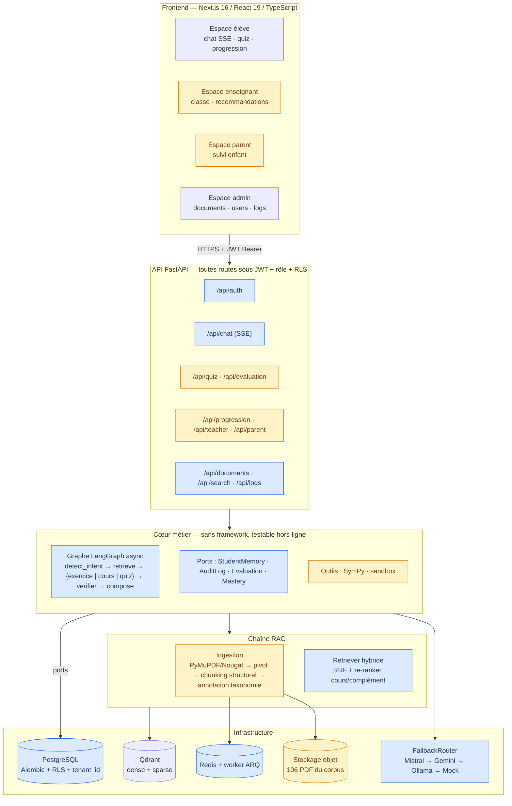
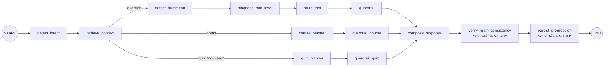

# Architecture cible et extraits d'implémentation

*Annexe technique de [`COMPARATIF_ARCHITECTURES.md`](COMPARATIF_ARCHITECTURES.md)
et [`SYNTHESE_REUNION_TECHNIQUE.md`](SYNTHESE_REUNION_TECHNIQUE.md).*

Ce document illustre **comment** les briques de NURU s'insèrent dans la structure
d'ATS. Les extraits ci-dessous sont des **esquisses d'implémentation** destinées
à la discussion : ils respectent les signatures réelles des deux dépôts mais
n'ont pas été exécutés.

---

## 1. Schéma de l'architecture cible



> **Bleu** = brique reprise d'ATS · **Jaune** = brique apportée par NURU.
> Les briques non colorées sont mixtes (§2 à §6).

---

## 2. Graphe de l'agent après fusion

La branche `quiz` de NURU s'ajoute au routage par intention existant d'ATS, sans
toucher aux deux branches en place :



Points d'attention pour l'implémentation :

- `Intent` (`agent/intent.py`) passe de 2 à 3 valeurs. **Le défaut doit rester
  `EXERCICE`** — c'est la règle de sûreté déjà appliquée pour le mode cours.
- Les deux nouveaux nœuds terminaux (`verify_math_consistency`,
  `persist_progression`) sont dans le graphe **complet** (a→f) uniquement ; en
  streaming SSE, ils sont appelés après épuisement du flux, comme
  `commit_memory()` aujourd'hui.

---

## 3. Re-ranker cours/complément au-dessus du RRF

**Problème.** ATS classe par RRF sans distinguer un cours d'un TD ; sur les 106
PDF (majoritairement des TD et annales), une question « explique-moi les nombres
complexes » remonte surtout des exercices.

**Solution.** Ne *pas* remplacer le RRF (§6.2 du comparatif) mais ajouter un
**post-traitement** sur son résultat, en réutilisant l'idée de
`search_course_first` de NURU.

### 3a. Annotation : distinguer cours et complément à l'ingestion

`config/taxonomy.py` — étendre l'énumération existante :

```python
class TypeChunk(str, Enum):
    COMPETENCE_COMPLETE = "competence_complete"
    CHAPITRE = "chapitre"
    SOUS_NOTION = "sous_notion"
    EXERCICE = "exercice"
    SOLUTION = "solution"      # nouveau — corrigés (NURU les distingue déjà)
    EXEMPLE = "exemple"        # nouveau

#: Types considérés comme « cours principal » lors du re-ranking pédagogique.
TYPES_COURS: frozenset[str] = frozenset({
    TypeChunk.COMPETENCE_COMPLETE.value,
    TypeChunk.CHAPITRE.value,
    TypeChunk.SOUS_NOTION.value,
})
```

Le classement se fait ainsi **une fois à l'ingestion**, à partir du chunking
structurel déjà en place — et non par inspection de chaînes de caractères à
chaque requête comme dans `_classify_doc_type` de NURU.

### 3b. Retriever : séparation et bonus

`vectorstore/retriever.py` — nouvelle méthode, l'existante reste inchangée :

```python
#: Bonus de rang appliqué aux chunks de cours. Exprimé en *rang* et non en score
#: brut : le score RRF (~1/(k+rang)) n'a pas d'échelle interprétable, alors qu'un
#: bonus de rang a un sens explicite (« un cours vaut N places »).
COURSE_RANK_BONUS = 3


@dataclass(frozen=True)
class PedagogicalResults:
    """Résultat de recherche séparé selon la nature pédagogique du document."""

    course: list[ScoredChunk]
    supplement: list[ScoredChunk]

    @property
    def has_course(self) -> bool:
        return bool(self.course)

    def all(self) -> list[ScoredChunk]:
        return [*self.course, *self.supplement]


class HybridRetriever:
    ...

    def retrieve_course_first(
        self,
        query: str,
        context: dict | None = None,
        *,
        top_k: int | None = None,
        supplement_quota: int = 2,
    ) -> PedagogicalResults:
        """Recherche à deux niveaux : cours d'abord, compléments sous quota.

        Le classement RRF est conservé tel quel ; on ne fait que le *partitionner*
        et tronquer. Aucune arithmétique sur les scores RRF, dont l'échelle n'est
        pas interprétable.
        """
        k = top_k or self._top_k
        # Sur-échantillonnage : il faut assez de candidats pour que la partition
        # laisse des cours ET des compléments.
        pool = self.retrieve(query, context, top_k=k * 4)

        course = [sc for sc in pool if sc.chunk.metadata.type_chunk in TYPES_COURS]
        supplement = [sc for sc in pool if sc.chunk.metadata.type_chunk not in TYPES_COURS]
        return PedagogicalResults(
            course=course[:k],
            supplement=supplement[:supplement_quota],
        )
```

### 3c. Nœud du graphe : refus explicite plutôt qu'hallucination

`agent/graph.py` — reprise de la doctrine du `CoursAgent` de NURU :

```python
@_timed_node("retrieve_context")
async def _n_retrieve(self, state: AgentState) -> dict:
    query = _condense_retrieval_query(state["question"], state.get("conversation_history", []))
    ctx = state.get("curriculum_context", {})

    if state.get("intent") == Intent.COURS.value:
        results = self._retriever.retrieve_course_first(query, ctx, top_k=self._top_k)
        return {
            "retrieved": results.all(),
            "course_docs": results.course,
            "supplement_docs": results.supplement,
            "has_course": results.has_course,
            "node_trace": [{
                "node": "retrieve_context",
                "n_sources": len(results.all()),
                "n_course": len(results.course),
                "has_course": results.has_course,
            }],
        }

    retrieved = self._retriever.retrieve(query, ctx, top_k=self._top_k)
    return {
        "retrieved": retrieved,
        "node_trace": [{"node": "retrieve_context", "n_sources": len(retrieved)}],
    }
```

Et dans `agent/prompt.py::assemble_course_prompt`, reprendre l'avertissement de
NURU quand `has_course` est faux :

```python
_NO_COURSE_WARNING = (
    "ATTENTION : les extraits fournis sont des TD et exercices, sans cours "
    "explicite. N'extrais que les éléments de cours réellement présents "
    "(rappels en tête de TD, énoncés de propriétés). Indique clairement en "
    "introduction que le cours complet n'est pas disponible dans le corpus. "
    "N'invente sous aucun prétexte le contenu manquant."
)
```

---

## 4. Modèle pédagogique : migration Alembic

Portage des tables de NURU sur les conventions d'ATS (UUID, `tenant_id`,
`Mapped[...]`, RLS). Ajout à `persistence/models.py` :

```python
class ConceptMastery(Base):
    """Niveau de maîtrise d'une notion par un élève (mastery learning).

    Importé du modèle NURU (`backend/app/memory/models.py::ConceptMastery`),
    porté sur les conventions du dépôt : identifiant UUID, ``tenant_id`` pour la
    RLS, typage ``Mapped[...]``, horodatage timezone-aware.
    """

    __tablename__ = "concept_mastery"
    __table_args__ = (
        UniqueConstraint("tenant_id", "student_id", "competence", name="uq_mastery_student_competence"),
        Index("ix_mastery_tenant_student", "tenant_id", "student_id"),
        CheckConstraint("mastery_score >= 0.0 AND mastery_score <= 1.0", name="ck_mastery_range"),
    )

    id: Mapped[str] = mapped_column(Uuid(as_uuid=False), primary_key=True, default=_uuid)
    tenant_id: Mapped[str] = mapped_column(String(64), nullable=False, index=True)
    student_id: Mapped[str] = mapped_column(String(128), nullable=False)
    # Nommé `competence` (et non `concept`) pour rester cohérent avec `progress`
    # et `audit_log`, qui utilisent déjà ce terme issu de la taxonomie.
    competence: Mapped[str] = mapped_column(String(255), nullable=False)
    chapitre: Mapped[str | None] = mapped_column(String(255), nullable=True)
    mastery_score: Mapped[float] = mapped_column(Float, nullable=False, default=0.0)
    attempts: Mapped[int] = mapped_column(Integer, nullable=False, default=0)
    successes: Mapped[int] = mapped_column(Integer, nullable=False, default=0)
    last_seen: Mapped[datetime] = mapped_column(DateTime(timezone=True), default=_utcnow, nullable=False)


class ExerciseResult(Base):
    """Résultat d'un exercice ou d'un quiz — alimente ConceptMastery et les badges."""

    __tablename__ = "exercise_results"
    __table_args__ = (
        Index("ix_exercise_results_tenant_student", "tenant_id", "student_id"),
        CheckConstraint("exercise_type IN ('exercice', 'quiz')", name="ck_exercise_type"),
    )

    id: Mapped[str] = mapped_column(Uuid(as_uuid=False), primary_key=True, default=_uuid)
    tenant_id: Mapped[str] = mapped_column(String(64), nullable=False, index=True)
    student_id: Mapped[str] = mapped_column(String(128), nullable=False)
    competence: Mapped[str | None] = mapped_column(String(255), nullable=True)
    chapitre: Mapped[str | None] = mapped_column(String(255), nullable=True)
    exercise_type: Mapped[str] = mapped_column(String(16), nullable=False, default="exercice")
    difficulty: Mapped[str] = mapped_column(String(16), nullable=False, default="intermediate")
    is_correct: Mapped[bool | None] = mapped_column(Boolean, nullable=True)
    score: Mapped[float | None] = mapped_column(Float, nullable=True)
    details: Mapped[dict | None] = mapped_column(JSONVariant, nullable=True)
    created_at: Mapped[datetime] = mapped_column(DateTime(timezone=True), default=_utcnow, nullable=False)


class StudentLink(Base):
    """Liaison parent/enseignant → élève.

    **Remplace à elle seule** `ParentStudent`, `TeacherStudent`, `Teacher` et
    `TeacherStudent` de NURU : une seule table, un seul chemin
    d'authentification (`users.role`), pas de second `password_hash`.
    """

    __tablename__ = "student_links"
    __table_args__ = (
        UniqueConstraint("tenant_id", "user_id", "student_id", name="uq_student_link"),
        Index("ix_student_links_tenant_user", "tenant_id", "user_id"),
    )

    id: Mapped[str] = mapped_column(Uuid(as_uuid=False), primary_key=True, default=_uuid)
    tenant_id: Mapped[str] = mapped_column(String(64), nullable=False, index=True)
    #: Compte parent ou enseignant (users.id) — le rôle est porté par `users`.
    user_id: Mapped[str] = mapped_column(Uuid(as_uuid=False), ForeignKey("users.id", ondelete="CASCADE"), nullable=False)
    student_id: Mapped[str] = mapped_column(String(128), nullable=False)
    created_at: Mapped[datetime] = mapped_column(DateTime(timezone=True), default=_utcnow, nullable=False)
```

Migration correspondante (`migrations/versions/0006_pedagogical_progress.py`),
avec les policies RLS sur le modèle de `0002_enable_rls` :

```python
def upgrade() -> None:
    op.create_table("concept_mastery", ...)
    op.create_table("exercise_results", ...)
    op.create_table("badges", ...)
    op.create_table("recommendations", ...)
    op.create_table("student_links", ...)

    for table in ("concept_mastery", "exercise_results", "badges",
                  "recommendations", "student_links"):
        op.execute(f"ALTER TABLE {table} ENABLE ROW LEVEL SECURITY")
        op.execute(f"""
            CREATE POLICY {table}_tenant_isolation ON {table}
            USING (tenant_id = current_setting('app.tenant_id', true))
        """)
```

Et l'extension des rôles (`0007_extend_roles.py`) :

```python
def upgrade() -> None:
    op.drop_constraint("ck_users_role", "users", type_="check")
    op.create_check_constraint(
        "ck_users_role", "users",
        "role IN ('admin', 'teacher', 'parent', 'student')",
    )
```

---

## 5. Corriger le défaut bloquant : appliquer les rôles

### Avant — NURU `backend/app/api/routes/admin.py`

```python
router = APIRouter(prefix="/admin", tags=["Administration"])

@router.get("/users")
async def list_admin_users():
    """Liste tous les comptes enregistrés en base de données."""
    _ensure_memory()
    from backend.app.memory.auth_service import get_all_users_admin
    users = get_all_users_admin()
    return {"users": users, "total": len(users)}
```

→ appelable par quiconque connaît l'URL ; renvoie tous les emails et rôles.

### Après — conventions ATS (`api/dependencies.py` existe déjà)

```python
from agent_tuteur.api.dependencies import require_admin, get_session
from agent_tuteur.api.security import Principal

router = APIRouter(prefix="/api/admin", tags=["administration"])


@router.get("/users", response_model=list[UserOut])
async def list_users(
    principal: Principal = Depends(require_admin),      # 401 sans jeton, 403 sans le rôle
    session: AsyncSession = Depends(get_session),        # positionne app.tenant_id → RLS
) -> list[UserOut]:
    """Comptes du tenant de l'appelant — jamais ceux des autres établissements."""
    return await UserRepository(session).list_for_tenant(principal.tenant_id)
```

### La règle d'accès la plus importante à porter

NURU : `GET /parent/students/{parent_id}` — l'identifiant vient de l'URL, donc
n'importe qui peut consulter n'importe quel parent.

Cible : **l'identité vient du jeton, jamais de la requête.**

```python
@router.get("/api/parent/students", response_model=list[StudentSummaryOut])
async def my_students(
    principal: Principal = Depends(get_current_user),
    session: AsyncSession = Depends(get_session),
) -> list[StudentSummaryOut]:
    if principal.role not in ("parent", "teacher"):
        raise HTTPException(status_code=403, detail="Réservé aux parents et enseignants.")
    # La liaison est lue en base pour CE compte : aucun identifiant d'élève
    # fourni par le client n'est jamais accepté tel quel.
    return await StudentLinkRepository(session).list_students_for(principal.user_id)
```

### Le test qui aurait empêché le défaut

Un test négatif par route, sur le modèle de `tests/api/test_auth.py` :

```python
@pytest.mark.parametrize("method,path", [
    ("GET",  "/api/admin/users"),
    ("GET",  "/api/parent/students"),
    ("GET",  "/api/teacher/class-stats"),
    ("POST", "/api/evaluation/quiz"),
    ("GET",  "/api/progression/eleve-1"),
])
async def test_route_exige_authentification(client, method, path):
    """Aucune route métier ne doit répondre sans jeton (régression NURU)."""
    resp = await client.request(method, path)
    assert resp.status_code == 401, f"{method} {path} accessible sans authentification"


async def test_parent_ne_voit_pas_un_eleve_non_lie(client, parent_token, autre_eleve):
    resp = await client.get(
        f"/api/progression/{autre_eleve.student_id}",
        headers={"Authorization": f"Bearer {parent_token}"},
    )
    assert resp.status_code == 403
```

---

## 6. Ajouter Gemini à la chaîne de repli

NURU dépend d'un seul fournisseur : si la clé manque, l'élève reçoit un mode
d'emploi de configuration. Dans la cible, Gemini devient un maillon parmi
d'autres.

`agent/llm/gemini.py` (nouveau, sur le modèle de `mistral.py`) :

```python
class GeminiLLM(BaseLLM):
    """Fournisseur Gemini via l'API HTTP (httpx), streaming inclus.

    Volontairement basé sur httpx comme MistralLLM plutôt que sur le SDK
    `google-generativeai` (utilisé par NURU) : le SDK est synchrone et
    bloquerait la boucle événementielle, et il n'expose pas de streaming
    asynchrone exploitable par le SSE de l'API.
    """

    name = "gemini"

    def __init__(self, api_key: str, model: str = "gemini-2.5-flash") -> None:
        self._api_key = api_key
        self._model = model

    def available(self) -> bool:
        return bool(self._api_key)

    async def generate(self, prompt: str, *, system: str | None = None) -> str:
        if not self._api_key:
            raise LLMError("Clé API Gemini absente.")
        ...  # POST :generateContent, LLMError sur toute erreur HTTP/réseau

    async def generate_stream(self, prompt: str, *, system: str | None = None) -> AsyncIterator[str]:
        ...  # POST :streamGenerateContent?alt=sse, yield fragment par fragment
```

`agent/llm/router.py` — la chaîne devient configurable :

```python
def build_router(*, backend: str = "auto", chain: str = "", **kwargs) -> FallbackRouter:
    """Construit la chaîne de repli.

    ``chain`` (ex. ``"gemini,mistral,mock"``) permet de changer le fournisseur
    principal **sans modifier le code** — c'est la réponse au point Q2 de la
    synthèse : l'arbitrage Gemini/Mistral devient un réglage `.env` réversible.
    Le dernier maillon reste toujours le mock : la génération n'échoue jamais.
    """
    providers = {
        "mistral": MistralLLM(...), "gemini": GeminiLLM(...),
        "ollama": OllamaLLM(...),   "mock": MockLLM(),
    }
    if chain:
        names = [n.strip() for n in chain.split(",") if n.strip() in providers]
        if "mock" not in names:
            names.append("mock")
        return FallbackRouter([providers[n] for n in names])
    ...  # comportement "auto" existant, inchangé
```

`config/settings.py` :

```python
LLMBackend = Literal["auto", "mistral", "gemini", "ollama", "mock"]

gemini_api_key: str = ""
gemini_model: str = "gemini-2.5-flash"
#: Ordre explicite de la chaîne de repli, ex. "gemini,mistral,mock".
#: Vide = composition automatique selon les clés disponibles.
llm_chain: str = ""
```

---

## 7. Frontend : les trois acquis d'ATS à porter obligatoirement

Si Next.js est retenu (Q1 de la synthèse), ces trois points **doivent** être
portés — sans eux la migration est une régression.

### 7a. Garde de route (remplace le `beforeEach` de vue-router)

`middleware.ts` :

```ts
import { NextResponse, type NextRequest } from 'next/server';

const PUBLIC = ['/login', '/_next', '/favicon.ico'];
const ADMIN_ONLY = ['/admin'];

export function middleware(req: NextRequest) {
  const { pathname } = req.nextUrl;
  if (PUBLIC.some((p) => pathname.startsWith(p))) return NextResponse.next();

  // Le jeton est en cookie httpOnly (et non localStorage comme aujourd'hui dans
  // les deux dépôts) : inaccessible au JavaScript, donc non exfiltrable par XSS.
  const token = req.cookies.get('tuteur_token')?.value;
  if (!token) {
    const url = req.nextUrl.clone();
    url.pathname = '/login';
    url.searchParams.set('redirect', pathname);
    return NextResponse.redirect(url);
  }

  if (ADMIN_ONLY.some((p) => pathname.startsWith(p)) && roleFromJwt(token) !== 'admin') {
    return NextResponse.redirect(new URL('/', req.url));
  }
  return NextResponse.next();
}
```

> Le contrôle de rôle côté client reste **cosmétique** : la seule autorité est le
> `Depends(require_admin)` côté API (§5). Il évite d'afficher un écran vide, il
> ne protège rien.

### 7b. Streaming SSE (absent de NURU)

Portage direct de `agent-tuteur-web/src/services/api.js` :

```ts
export async function* streamChat(
  body: ChatRequest,
  signal?: AbortSignal,
): AsyncGenerator<ChatEvent> {
  // `fetch` et non `EventSource` : EventSource ne permet pas de porter
  // l'en-tête Authorization (raison déjà documentée dans le frontend Vue).
  const resp = await fetch('/api/chat', {
    method: 'POST',
    headers: { 'Content-Type': 'application/json', Accept: 'text/event-stream' },
    credentials: 'include',
    body: JSON.stringify(body),
    signal,
  });
  if (!resp.ok || !resp.body) throw await toApiError(resp);

  const reader = resp.body.getReader();
  const decoder = new TextDecoder();
  let buffer = '';
  while (true) {
    const { done, value } = await reader.read();
    if (done) break;
    buffer += decoder.decode(value, { stream: true });
    const lines = buffer.split(/\r?\n/);
    buffer = lines.pop() ?? '';           // fragment incomplet conservé
    for (const line of lines) {
      if (!line.startsWith('data:')) continue;
      const payload = line.slice(5).trim();
      if (payload) yield JSON.parse(payload) as ChatEvent;
    }
  }
}
```

### 7c. Types générés, pas écrits à la main

```bash
# Le schéma OpenAPI de FastAPI devient la source de vérité du contrat.
npx openapi-typescript http://localhost:8000/openapi.json -o src/types/api.d.ts
```

Un renommage de champ côté API casse alors la compilation du frontend, au lieu de
produire un `undefined` silencieux à l'exécution. C'est le mécanisme qui empêche
les deux moitiés du projet de re-diverger.

### 7d. Ce qu'il faut supprimer avant toute reprise

```diff
- // AuthContext.tsx — élévation de privilège
- } catch (err: any) {
-   let fallbackRole: UserRole = 'student';
-   if (email.includes('admin')) fallbackRole = 'admin';
-   ...
+ } catch (err) {
+   // Un backend injoignable est une erreur, pas une connexion réussie.
+   throw new AuthError("Service indisponible, réessayez dans un instant.");
  }
```

```diff
- // lib/api.ts — masque les pannes derrière des chiffres inventés
- export async function fetchAdminStats() {
-   try { ... } catch { return { total_users: 0, rag_vectors_count: 2635, courses_count: 32 }; }
- }
+ export async function fetchAdminStats(): Promise<AdminStats> {
+   const res = await fetch(`${API}/api/admin/stats`, { credentials: 'include' });
+   if (!res.ok) throw await toApiError(res);   // l'appelant affiche un état d'erreur
+   return res.json();
+ }
```

---

## 8. Structure de dépôt cible

```
agent-tuteur/
├── agent-tuteur-api/               # inchangé (base ATS)
│   ├── pyproject.toml              # + extras : parsing (pymupdf), llm-gemini
│   ├── migrations/versions/
│   │   ├── 0001…0005               # existantes
│   │   ├── 0006_pedagogical_progress.py    ← §4
│   │   └── 0007_extend_roles.py            ← §4
│   ├── src/agent_tuteur/
│   │   ├── agent/
│   │   │   ├── graph.py            # + branche quiz, + nœuds verify/progression
│   │   │   ├── quiz.py             ← porté de NURU (QuizAgent)
│   │   │   ├── evaluation.py       ← porté de NURU (EvaluationAgent)
│   │   │   ├── mastery.py          ← porté de NURU (ProgressionAgent)
│   │   │   ├── verify.py           ← 2 contrôles déterministes de NURU
│   │   │   ├── ports.py            # + EvaluationPort, MasteryPort
│   │   │   └── llm/gemini.py       ← §6
│   │   ├── ingestion/
│   │   │   └── loaders/
│   │   │       ├── pymupdf.py      ← porté de NURU
│   │   │       ├── nougat.py       ← porté de NURU (optionnel)
│   │   │       ├── cleaners.py     ← porté de NURU
│   │   │       └── metadata/       ← porté de NURU (3 extracteurs)
│   │   ├── vectorstore/retriever.py  # + retrieve_course_first  ← §3
│   │   └── api/routes/
│   │       ├── quiz.py  evaluation.py  teacher.py  parent.py     ← nouveaux
│   └── tests/                      # 145 ATS + 58 portés de NURU + tests 401/403
├── agent-tuteur-web/               # Next.js 16 / React 19 / TS  ← §7
├── agent-tuteur-deploy/            # inchangé (base ATS) + service Qdrant obligatoire
├── corpus/                         # fixtures de test uniquement (5 md + 12 leçons)
└── docs/
    ├── adr/0010-fusion-nuru-ats.md ← trace de la décision
    ├── COMPARATIF_ARCHITECTURES.md
    ├── SYNTHESE_REUNION_TECHNIQUE.md
    └── ARCHITECTURE_CIBLE.md       ← ce document
```

Le corpus de production (106 PDF) **n'est pas dans le dépôt** : stockage objet,
avec un script d'ingestion versionné (§7.2/P0 du comparatif).

---

## 9. Critères de sortie de la fusion

La fusion est terminée quand **tous** ces points sont vrais — et pas avant :

| # | Critère | Vérification |
|---|---|---|
| 1 | La suite de tests unifiée passe | `pytest` vert, ≥ 200 tests |
| 2 | Aucune route métier accessible sans jeton | test paramétré 401 sur toutes les routes (§5) |
| 3 | Un parent/enseignant ne voit que ses élèves liés | test 403 sur élève non lié (§5) |
| 4 | Les 106 PDF sont ingérés et interrogeables | `recall@5` mesuré sur le jeu d'évaluation |
| 5 | Le re-ranker cours/TD améliore le « cours en tête » | comparaison avant/après sur le même jeu |
| 6 | Aucun écran frontend ne contient de donnée figée | `grep -r mockData src/` vide |
| 7 | Le chat streame en SSE de bout en bout | vérifié dans un navigateur |
| 8 | Un changement de LLM ne demande aucune modification de code | `LLM_CHAIN` dans `.env` |
| 9 | Le dépôt pèse moins de 10 Mo | `du -sh .git` |
| 10 | La CI bloque une PR qui casse les tests | PR de démonstration en échec |
```
